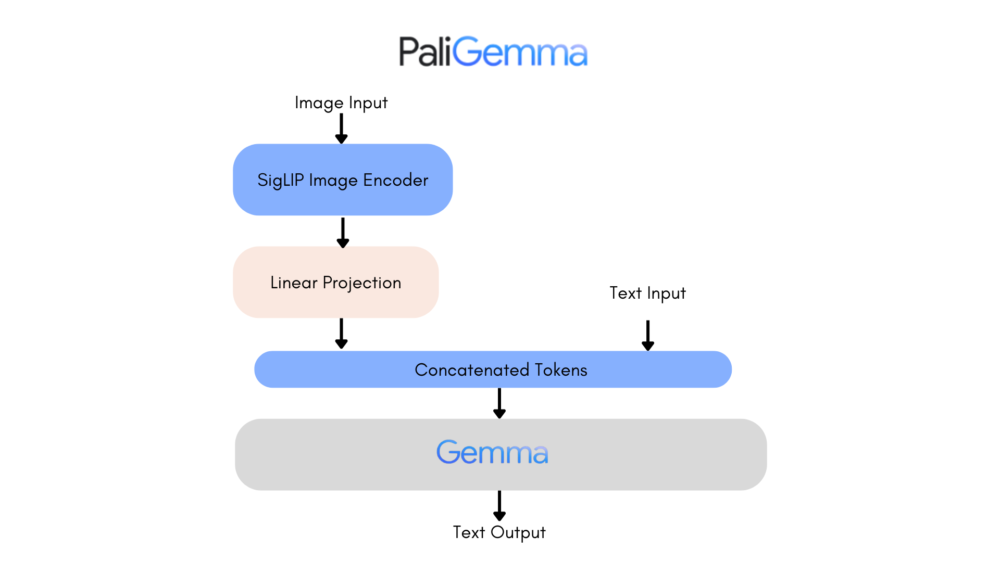

# Small Tweaks For PaliGemma (Ongoing)

## Introduction

PaliGemma is a cutting-edge multimodal AI model that combines the power of language understanding with visual comprehension. Built on the latest advancements in machine learning, PaliGemma offers state-of-the-art performance in tasks involving both text and images. 

## Improvements

- **Precision**: Set float32 matmul precision from highest to high. This is to provide a speedup in the training process.

- **Dtype Conversion**: Converted the model to bfloat16 for faster training.

- **Compiling**: Compiled the model with max autotune with full graph optimization.

- **Projection Fusing**: Fused query, key, and value projections into a single linear layer. This is to reduce the number of operations and improve the computational efficiency.

- **SDPA**: Convert regular self attention to PyTorch's flas attention implementation for both language and vision models, significantly improving computational efficiency speeding up the train and inference time.

- **Training**: Added Training loop as well as simple dataset support.

## TODO
- Implement SoViT-400m architecture, which is the shape-optimized version of the original SigLIP.

- Get pretrained model and perform finetune on user data.

## Acknowledgements

- Huggingface implementation can be found [here](https://github.com/hkproj/pytorch-paligemma/tree/main)

